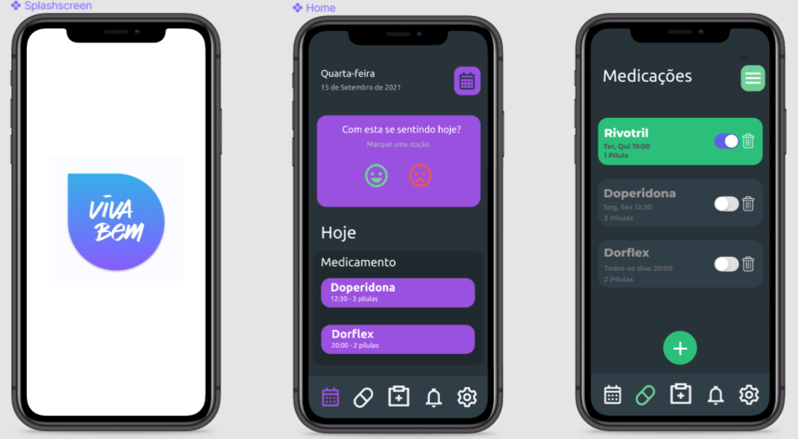
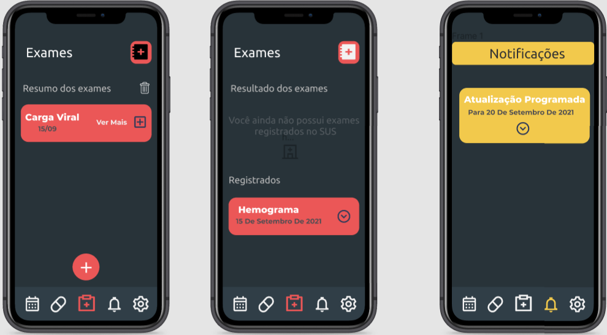

## <a>Introdução</a>

Com base no desenvolvimento das entregas anteriores, o protótipo serve para confirmar se o que planejamos e construímos foi realmente atingido de forma clara e eficiente.

## <a>Objetivo</a>

Com esse protótipo, queremos ter a certeza de que baseado no aplicativo original, conseguimos corresponder os requisitos elicitados nas etapas anteriores. Assim, inserimos esses requisitos na prototipagem básica abaixo.

## <a>Protótipo</a>

O protótipo abaixo foi desenvolvido com base nos requisitos presentes no aplicativo original VivaBem, e com ele, desenvolvemos com base no que priorizamos nas etapas anteriores. Criamos os protótipos das principais funcionalidades disponíveis no aplicativo. Construimos esses designs no site <a>Figma</a> que é especializado para esse tipo de situação.

<figcaption>Figura 1: Telas (SplashScreen, Home, Medicações)</figcaption>

 

<figcaption>Figura 2: Telas (Exames Resumo, Exames Resultados, Notificações)</figcaption>

 

<figcaption>Figura 3: Tela Mais opções</figcaption>

 

<figcaption>O protótipo foi desenvolvido no Figma e pode ser acessado através deste <a href='https://www.figma.com/proto/vZA21L0yDLYZqevAP4U2GL/e-T%C3%ADtulo?kind=&node-id=1%3A2&scaling=scale-down' target='_blank'>link</a></figcaption>

## Referências e Bibliografias

> SOMMERVILLE, Ian. Engenharia de Software. 9.ed. São Paulo: Pearson Prentice Hall, 2011. 529 p.

## Versionamento

| Versão | Data | Modificação | Autor |
|--|--|--|--|
| 1.0 | 15/09/2021 | Criação do documento | Gabriel Avelino|
| 2.0 | 16/09/2021 | Criação do protótipo | Gabriel Avelino |
| 3.0 | 17/09/2021 | Revisão do documento| Ítalo Serra (Revisor) |