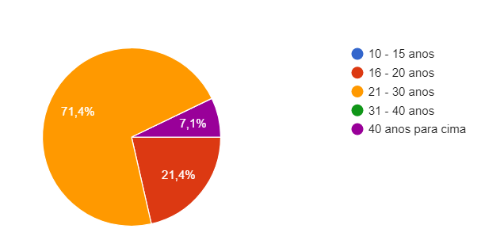

## 1. Introdução 

Pelo questionário ser uma técnica simples, escolhemos utilizá-la para ajudar o projeto em relação à elicitação de requisitos, por ser uma técnica que conta com participação pública em relação ao aplicativo VivaBem, nos ajudou a entender mais a opnião dos usuários e suas dúvidas sobre o aplicativo, com perguntas simples e rápidas de responder.

Com a partipação do publico conseguimos perceber como o aplicativo é utilizado, conseguindo elicitar os requisitos a partir das respostas dadas no questionário.

## 2. Perguntas escolhidas

Com as perguntas que fizemos, descobrimos se a pessoa que está respondendo o questionário conhece e faz uso do aplicativo. Por meio do <a>google forms</a> fizemos as seguintes questões:

- O usuário conhece o aplicativo?
- Alguns dados do usuário.
- Quais as melhores funcionalidades do aplicativo?
- As respostas nos ajudam a identificar o público alvo?
- O questionário nos ajuda a perceber o comportamento do usúario em relacão ao aplicativo?

## 3. Resultados do questionário
As perguntas realizadas no questionário e suas respostas estão listadas abaixo:

## 4. Requisitos elicitados

|Número | Requisito | Tipo |
|:--:|:--:|:--:|
| 1 | Descrever funcionalidades principais na tela inicial | Funcional |
| 2 | Oferecer tutorial no primeiro uso do aplicativo | Funcional |
| 3 | Receber notificações do aplicativo | Funcional |
| 4 | Poder visualizar novidades| Funcional |
| 5 | Cadastrar medicamentos e exames | Funcional |
| 6 | Apresentar as funcionalidades de uma forma mais visual | Não funcional |
| 7 | Demonstrar como as funcionalidades acontecem | Não funcional |
| 8 | Aumentar a acessibilidade para usuários com dificuldades | Não funcional|

<figcaption>Tabela 1 - Requisitos elicitados</figcaption>

## Referências e Bibliografias

>https://www.maxwell.vrac.puc-rio.br/15760/15760_3.PDF

## Versionamento
| Versão | Data | Modificação | Autor |
|--|--|--|--|
| 1.0 | 18/09/2021 | Criação do documento, listagem das respostas e elicitação dos requisitos | Gabriel Avelino |
| 1.1 | 19/03/2021 | listagem das respostas e  tabela elicitação dos requisitos | Gabriel Avelino |
