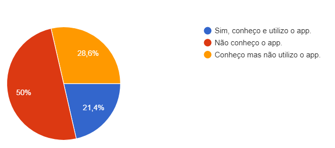
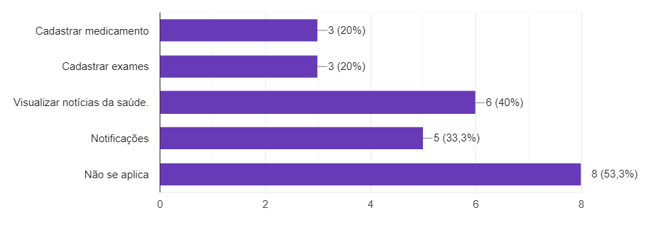
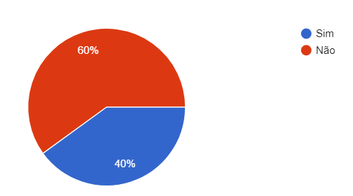

# 1. Introdução 

Pelo questionário ser uma técnica simples, escolhemos utilizá-la para ajudar o projeto em relação à elicitação de requisitos, por ser uma técnica que conta com participação pública em relação ao aplicativo VivaBem, nos ajudou a entender mais a opnião dos usuários e suas dúvidas sobre o aplicativo, com perguntas simples e rápidas de responder.

Com a partipação do publico conseguimos perceber como o aplicativo é utilizado, conseguindo elicitar os requisitos a partir das respostas dadas no questionário.

# 2. Perguntas escolhidas

Com as perguntas que fizemos, descobrimos se a pessoa que está respondendo o questionário conhece e faz uso do aplicativo. Por meio do <a>google forms</a> fizemos as seguintes questões:

- O usuário conhece o aplicativo?
- Alguns dados do usuário.
- Quais as melhores funcionalidades do aplicativo?
- As respostas nos ajudam a identificar o público alvo?
- O questionário nos ajuda a perceber o comportamento do usúario em relacão ao aplicativo?

# 3. Resultados do questionário
As perguntas realizadas no questionário e suas respostas estão listadas abaixo:

## 3.1 Qual sua idade?

<figcaption> Figura 1: Gráfico da questão da idade usuário </figcaption>

A partir dessa primeira questão do questionário, queriamos descobrir a faixa etário do público que utiliza o aplicativo ou que possui algum interesse nele. Com essa pergunta concluimos que o público que estamos usando como análise é mais jovem.

## 3.2 Você conhece/utiliza o aplicativo VivaBem?

<figcaption> Figura 2: Gráfico da questão sobre uso do aplicativo </figcaption>

Com essa pergunta percebemos que metade do público questionado não conhece o aplicativo VivaBem e apenas uma parcela conhece e utiliza o app.

## 3.3 Qual a frequência de uso do aplicativo?

<figcaption> Figura 3: Gráfico sobre a frequência do uso do aplicativo </figcaption>

Como a maioria do público não conhece o aplicativo a frequência de uso da maioria não se aplica, pórem para quem conhece e usa o app a frequência é de mais de uma vez por semana.

## 3.4 Você usa medicamentos?

<figcaption> Figura 4: Gráfico sobre o uso de medicamentos do usuário </figcaption>

Com essa pergunta queriamos ver quantas pessoas que responderam o questionário usam medicamentos, visto que o aplicativo é direcionado a esse público, com esses dados vimos que a maioria não usa de remédios.

## 3.5 Quais as funcionalidades do VivaBem você mais usa?

<figcaption> Figura 5: Gráfico da questão da idade usuário </figcaption>

Essas respostas serviram para saber quas funcionalidades do app são as mais utilizadas pelo público que marcou que utiliza ele, a maioria foi ver as nóticias do mundo da sáude e cadastrar os medicamentos.

## 3.6 Alguma funcionalidade não opera corretamente?

<figcaption> Figura 6: Gráfico da questão da idade usuário </figcaption>

Essa pergunta foi para ver quais funcionalidades que o público percebeu que não operam corretamente, como a maioria utiliza a função de visualizar as notícias do mundo da saúde, ela foi também a que aparenta ter mais erros de funcionalidade.

## 3.7 Você acredita que o aplicativo seja útil para o seu dia a dia?

<figcaption> Figura 7: Gráfico da questão da idade usuário </figcaption>

Como a maioria não conhece ou não utiliza o app e não usam medicamentos, a grande parte dos votos foram para que não seja útil o app, pórem para quem usa, acredita-se ser muito útil.

## 4. Requisitos elicitados

|Número | Requisito | Tipo |
|:--:|:--:|:--:|
| 1 | Descrever funcionalidades principais na tela inicial | Funcional |
| 2 | Oferecer tutorial no primeiro uso do aplicativo | Funcional |
| 3 | Receber notificações do aplicativo | Funcional |
| 4 | Poder visualizar novidades| Funcional |
| 5 | Cadastrar medicamentos e exames | Funcional |
| 6 | Apresentar as funcionalidades de uma forma mais visual | Não funcional |
| 7 | Demonstrar como as funcionalidades acontecem | Não funcional |
| 8 | Aumentar a acessibilidade para usuários com dificuldades | Não funcional|

<figcaption>Tabela 1 - Requisitos elicitados</figcaption>

## Referências e Bibliografias

>https://www.maxwell.vrac.puc-rio.br/15760/15760_3.PDF

## Versionamento
| Versão | Data | Modificação | Autor |
|--|--|--|--|
| 1.0 | 18/09/2021 | Criação do documento, listagem das respostas e elicitação dos requisitos | Gabriel Avelino |
| 1.1 | 19/03/2021 | listagem das respostas e  tabela elicitação dos requisitos | Gabriel Avelino |
