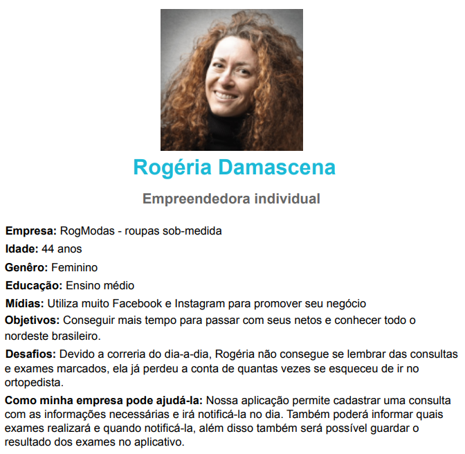

## <a>Personas</a>

Uma persona é um personagem fictício, arquétipo hipotético de um grupo de usuários reais, criada para descrever um usuário típico (Cooper et al., 2007; Pruitt e Adlin, 2006; Cooper, 1999). Uma persona representa um grupo de usuários que irá utilizar o software durante as discussões de design.

A existência da representação de um usuário mantém os desenvolvedores focados nos desejos e anseios da persona, que são os anseios e desejos de um grupo de usuários de forma mais refinada. 

A quantidade personas varia de acordo com a quantidade de grupos de usuários existentes no seu projeto. No contexto do VivaBem, possuímos apenas um grupo de usuário que seria uma pessoa, maior de idade e que faz algum tipo de acompanhamento médico, baseado nisso, o time decidiu por criar duas personas e uma anti-persona, que é uma persona que não se baseia no grupo de usuário, ou seja, uma persona que nem chegará a utilizar a aplicação.

### <a>Personas</a>

*Figura 1 - Primeira Persona*

*Figura 2 - Segunda Persona*

### <a>Anti-persona</a>

*Figura 3 - Anti-Persona*

## <a>Versionamento</a>

|    Data    | Versão |              Alteração              | Responsável(eis) |
| :--------: | :----: | :---------------------------------: | :--------------: |
| 19/08/2021 |  1.0   | Criação do documento e das personas | Philipe Serafim  |

## <a>Bibliografia</a>

BARBOSA S. D. J.; SILVA B. S. <strong>Interação Humano-Computador</strong> ed. Elsevier, 2010.
