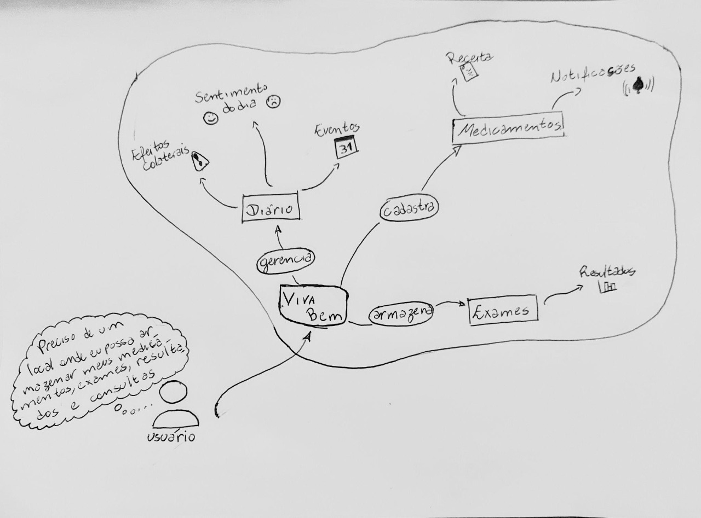
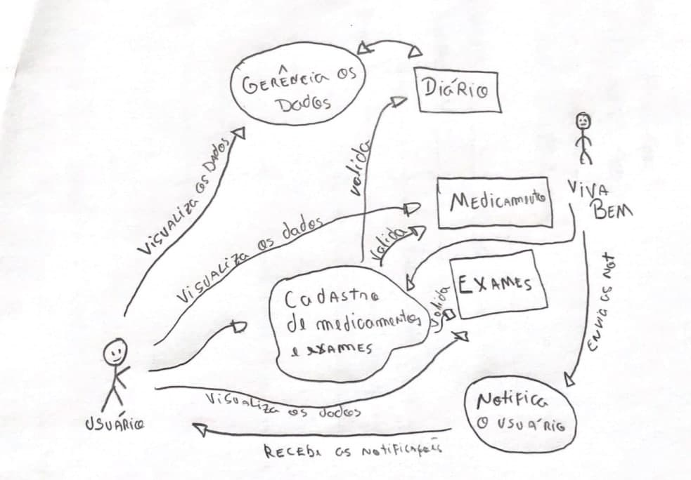
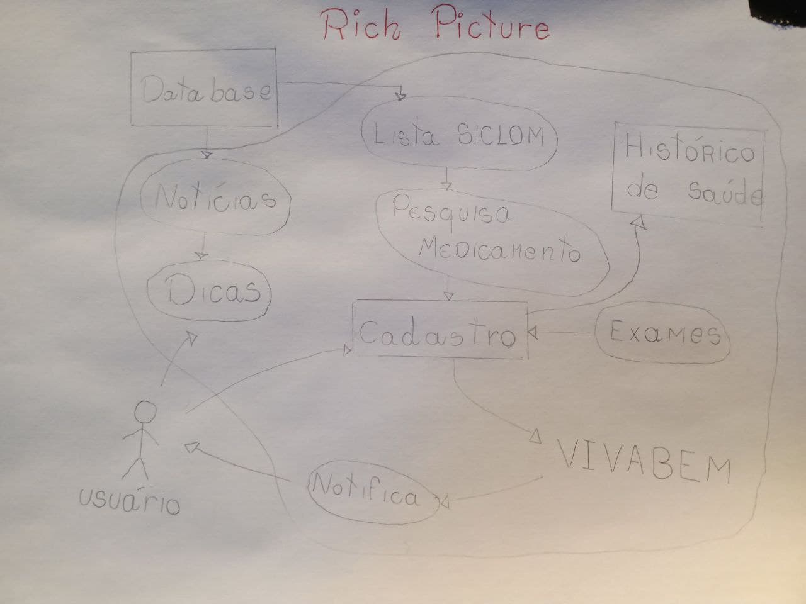
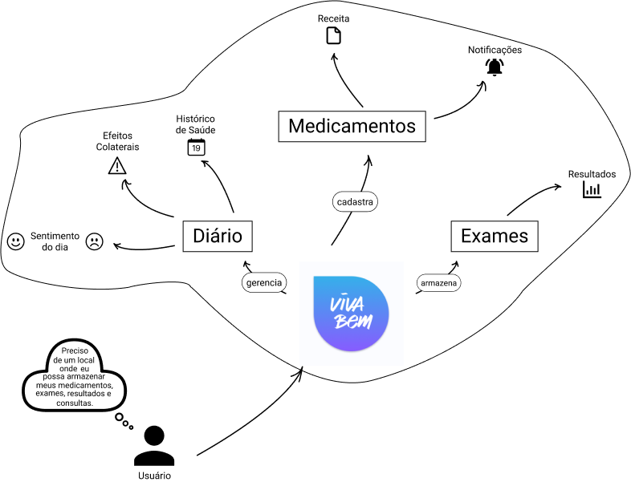

## <a>Rich Picture</a>

Rich Picture é um artefato que deve ser construído, preferencialmente, com o auxílio dos stakeholders. O objetivo do rich picture auxiliar a compreensão do problema a ser resolvido através da ilustração.

Não há formalidades sobre a criação, podendo ser realizado a mão e com ou sem auxílio de softwares voltados para isso.
Mesmo não havendo formalidades é necessário seguir algumas notações para criação do rich picture:

|      Componente      | Significado                                                                                                                                       |
| :------------------: | ------------------------------------------------------------------------------------------------------------------------------------------------- |
|        Atores        | São os usuários do sistema, representados por avatares ou até mesmo pessoas de palitinho                                                          |
|      Operações       | Operação é o que o sistema faz, suas funções. Cada operação deve ser executada por um ator ou até mesmo outra operação, representadas por elipses |
|    Banco de dados    | São as tabelas da sua base de dados, onde são armazenadas as informações, dados e arquivos do sistema, representados por retângulos               |
|        Setas         | Indicam a direção das informações, o fluxo entre atores, banco de dados e operações                                                               |
| Fronteira do sistema | É o que delimita qual parte do que está representado no papel é responsabilidade da aplicação.                                                    |
*Tabela 1 - Guia de notações do rich-picture *

## <a>Rich Pictures</a>

### <a>Feitos à mão</a>

*Figura 1 - Rich picture, Autor - Philipe Serafim*

 

*Figura 2 - Rich picture, Autor - Gabriel Avelino*

 

*Figura 3 - Rich picture, Autor - João Victor*

### <a>Versão final</a>

*Figura 4 - Última versão do rich picture*

## <a>Versionamento</a>

|    Data    | Versão |      Alteração       | Responsável(eis) |
| :--------: | :----: | :------------------: | :--------------: |
| 19/08/2021 |  1.0   | Criação do documento | Philipe Serafim  |

## <a>Bibliografia</a>

KLAUS P.; CHRIS R. <strong>Requirements Engineering Fundamentals</strong> ed. RockyNook, 2015.

Rich Picture. Disponível em: <http://systems.open.ac.uk/materials/T552/pages/rich/richAppendix.html>
Acesso em: 19/08/2021

